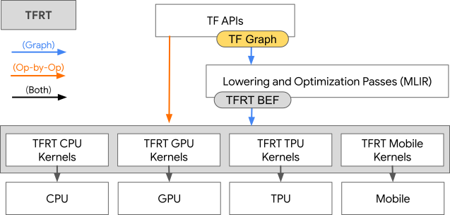
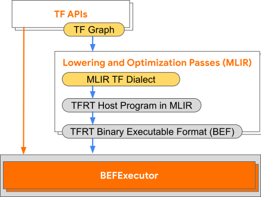

# TFRT: A New TensorFlow Runtime

TFRT is a new TensorFlow runtime. It aims to provide a unified, extensible
infrastructure layer with best-in-class performance across a wide variety of
domain specific hardware. It provides efficient use of multithreaded host CPUs,
supports fully asynchronous programming models, and focuses on low-level
efficiency.

TFRT will benefit a broad range of users, but it will be of particular interest
to you if you are a:

*   Researcher looking to experiment with complex new models and add custom
    operations to TensorFlow
*   Application developer looking for improved performance when serving models
    in production
*   Hardware maker looking to plug hardware into TensorFlow, including edge and
    datacenter devices

...or you are simply curious about cool ML infrastructure and low-level runtime
technology!

To learn more about TFRT’s early progress and wins, check out our
[Tensorflow Dev Summit 2020 presentation](https://www.youtube.com/watch?v=15tiQoPpuZ8)
where we provided a performance benchmark for small-batch GPU inference on
ResNet 50, and our
[MLIR Open Design Deep Dive presentation](https://drive.google.com/drive/folders/1fkLJuVP-tIk4GENBu2AgemF3oXYGr2PB)
where we provided a detailed overview of TFRT’s core components, low-level
abstractions, and general design principles.

**Note:** TFRT is an early stage project and is not yet ready for general use.

## Getting started

**TLDR:** This section describes how to set up a development environment for
TFRT, as well as instructions to build and test TFRT components.

TFRT currently supports Ubuntu-16.04. Future supported platforms include MacOS,
Windows, etc. Bazel and clang are required to build and test TFRT. NVIDIA's CUDA
Toolkit and cuDNN libraries are required for the GPU backend.

To describe the TFRT build and test workflows, we will build and run the
following binaries for graph execution.

Recall from our Dev Summit presentation that for graph execution, a TensorFlow
user passes into TFRT a TensorFlow graph created via high-level TensorFlow APIs,
and TFRT then calls the [MLIR](https://www.tensorflow.org/mlir)-based graph
compiler to optimize and lower the graph into
[BEF](documents/binary_executable_format.md), a Binary Executable Format for
TFRT graph execution (MLIR is the compiler infrastructure that we use to
represent TFRT host programs). The blue arrows in the simplified TensorFlow
training stack diagram below show this flow.

<div align="center">

</div>

The two binaries introduced next focus on the backend of the graph execution
workflow. After the graph compiler has optimized the TensorFlow graph and
produced a low-level TFRT Host Program represented in MLIR, `tfrt_translate`
generates a `BEF` file from that host program and `bef_executor` runs the `BEF`
file. The progression from TFRT Host Program to `bef_executor` via
`tfrt_translate` is depicted in the expanded TensorFlow training stack diagram
below. Note that the blue arrow between TFRT Host Program and `BEF` file
represents `tfrt_translate`. Both programs are built in the `tools` directory.

<div align="center">

</div>

#### tfrt_translate

The `tfrt_translate` program does round trip translation between MLIR and BEF,
similar to an assembler and disassembler.

#### bef_executor

The `bef_executor` program is the execution driver of `BEF` files. It reads in a
`BEF` file, sets up runtime, and asynchronously executes function(s) in that
file.

### Prerequisites

#### Install Bazel

To build TFRT, you need to install Bazel. TFRT is built and verified with Bazel
2.0.0 to 3.1.0. Follow
[the Bazel installation instructions](https://docs.bazel.build/versions/master/install-ubuntu.html)
to install Bazel. Verify the installation with

```shell
$ bazel --version
bazel 3.1.0
```

#### Install clang

Follow [the clang installation instructions](https://apt.llvm.org/) to install
clang. The automatic installation script that installs clang, lldb, and lld, is
recommended. TFRT is built and verified with 9.0.0 and above.

If you have multiple versions of clang installed, ensure that the correct
version of clang is the default. On Ubuntu based systems, you can use
`update-alternatives` to select the default version. The following example
commands assume you installed clang-9:

```shell
$ sudo update-alternatives --install /usr/bin/clang clang /usr/bin/clang-9 9
$ sudo update-alternatives --install /usr/bin/clang++ clang++ /usr/bin/clang++-9 9
```

Verify the installation with

```shell
$ clang --version
clang version 9.0.1-6
```

#### Install libstdc++

TFRT requires libstdc++8 or greater. Check clang's selected version with

```shell
$ clang++ -v |& grep "Selected GCC"
Selected GCC installation: /usr/bin/../lib/gcc/x86_64-linux-gnu/9
```

In the example above, the *9* at the end of the path indicates that clang will
use libstdc++<em>9</em>, which is compatible with TFRT.

If you need to upgrade, the easiest way is to install gcc-8. Run the following
command to install:

```shell
$ sudo add-apt-repository -y ppa:ubuntu-toolchain-r/test
$ sudo apt-get update
$ sudo apt-get install -y gcc-8 g++-8
```

To verify installation, re-run the `clang++ -v` check above.

#### GPU prerequisites

**Note:** You can skip this section if you don't want to build the GPU backend.
Remember to exclude `//backends/gpu/...` from your Bazel target patterns though.

Building and running the GPU backend requires installing additional components.

Install clang Python bindings using pip with

```shell
$ pip3 install clang
```

Alternatively, you can use apt and add the install location to sys.path with

```shell
$ apt-get install -y python3-clang-10
$ echo '/usr/lib/python3/dist-packages' > "$(python3 -m site --user-site)/dist-packages.pth"
```

Install NVIDIA's CUDA Toolkit v10.2 (see
[installation guide](https://docs.nvidia.com/cuda/cuda-installation-guide-linux)
for details) in a single directory from NVIDIA’s `.run` package with

```shell
$ wget http://developer.download.nvidia.com/compute/cuda/10.2/Prod/local_installers/cuda_10.2.89_440.33.01_linux.run
$ sudo sh cuda_10.2.89_440.33.01_linux.run --silent --toolkit --toolkitpath=<path>
```

Register the path to CUDA shared objects with

```shell
$ sudo echo '<path>/lib64' > '/etc/ld.so.conf.d/cuda.conf'
$ sudo ldconfig
```

Install NVIDIA's cuDNN v7.6 libraries (see
[installation guide](http://docs.nvidia.com/deeplearning/sdk/cudnn-install) for
details) with

```shell
$ wget http://developer.download.nvidia.com/compute/machine-learning/repos/ubuntu1604/x86_64/libcudnn7_7.6.5.32-1+cuda10.2_amd64.deb
$ sudo apt install ./libcudnn7_7.6.5.32-1+cuda10.2_amd64.deb
```

### Building and running TFRT

To build TFRT, `cd` to the root directory (where `WORKSPACE` file is located) of
the TFRT workspace. A set of build configurations is in `.bazelrc` file. You can
create a `user.bazelrc` in the repository root with extra Bazel configs that may
be useful. Build `tfrt_translate` and `bef_executor` with the following
commands:

```shell
$ bazel build //tools:bef_executor
$ bazel build //tools:tfrt_translate
```

The above commands build the binaries with `opt` compilation mode. Check
[Bazel's documentation](https://docs.bazel.build/versions/master/command-line-reference.html#build-options)
for more build options. Bazel will notify the output location at the end of a
successful build (default is `bazel-bin`).

After `tfrt_translate` and `bef_executor` are built, run an `.mlir` program with
the following command:

```shell
$ bazel-bin/tools/tfrt_translate -mlir-to-bef path/to/program.mlir | bazel-bin/tools/bef_executor
```

TFRT provides a series of .mlir test programs. For example:

```shell
$ bazel-bin/tools/tfrt_translate -mlir-to-bef mlir_tests/bef_executor/async.mlir | bazel-bin/tools/bef_executor
```

Any output will be printed out to the terminal.

### Adding GPU support

Add `--config=cuda` to the Bazel command to link the GPU backend to the above
targets.

Custom CUDA Toolkit locations can be specified with
`--repo_env=CUDA_PATH=<path>`. The default is `/usr/local/cuda`.

### Testing

TFRT utilizes LLVM’s [LIT](https://llvm.org/docs/CommandGuide/lit.html)
infrastructure and
[FileCheck](https://llvm.org/docs/CommandGuide/FileCheck.html) utility tool to
construct MLIR-based check tests. These tests verify that some set of string
tags appear in the test’s output. More introduction and guidelines on testing
can be found
[here](https://mlir.llvm.org/getting_started/TestingGuide/#check-tests). An
example test is shown below:

```c++
// RUN: tfrt_translate -mlir-to-bef %s | bef_executor | FileCheck %s
// RUN: tfrt_opt %s | tfrt_opt

// CHECK-LABEL: --- Running 'basic_tensor'
func @basic_tensor() {
  %c0 = tfrt.new.chain

  %a = dht.create_uninitialized_tensor.i32.2 [3 : i64, 2 : i64]
  %c1 = dht.fill_tensor_with_constant.i32 %a, %c0 0 : i32

  // CHECK: shape = [3, 2], values = [0, 0, 0, 0, 0, 0]
  %c2 = dht.print_tensor %a, %c1

  tfrt.return
}
```

To run a test, simply invoke `bazel test`:

```shell
$ bazel test //mlir_tests/bef_executor:basics.mlir.test
```

Most tests under `//backends/gpu/...` need to be built with `--config=cuda` so
that the GPU backend is linked to the bef_executor:

```shell
$ bazel test --config=cuda //backends/gpu/mlir_tests/core_runtime:get_device.mlir.test
```

Use Bazel
[target patterns](https://docs.bazel.build/versions/master/guide.html#specifying-targets-to-build)
to run multiple tests:

```shell
$ bazel test -- //... -//third_party/... -//backends/gpu/...  # All CPU tests.
$ bazel test --config=cuda //backends/gpu/...                 # All GPU tests.
```

### Next Steps

Try our [tutorial](documents/tutorial.md) for some hands-on experience with
TFRT.

See [host runtime design](documents/tfrt_host_runtime_design.md) for more
details on TFRT's design.

## Repository Overview

The three key directories under the TFRT root directory are

*   `lib/`: Contains core TFRT infrastructure code
*   `backends/`: Contains device specific infrastructure and op/kernel
    implementations
*   `include/`: Contains public header files for core TFRT infrastructure

<table>
  <tr>
   <td><strong>Top level directory</strong>
   </td>
   <td><strong>Sub-directory</strong>
   </td>
   <td><strong>Description</strong>
   </td>
  </tr>
  <tr>
   <td colspan="2" ><strong><code>include/</code></strong>
   </td>
   <td>TFRT infrastructure public headers
   </td>
  </tr>
  <tr>
   <td colspan="2" ><strong><code>lib/</code></strong>
   </td>
   <td>TFRT infrastructure common for host runtime and all device runtime
   </td>
  </tr>
  <tr>
   <td>
   </td>
   <td><code>basic_kernels/</code>
   </td>
   <td>Common infrastructure kernels, e.g. control flow kernels
   </td>
  </tr>
  <tr>
   <td>
   </td>
   <td><code>bef_executor/</code>
   </td>
   <td>BEFFile and BEFExecutor implementation
   </td>
  </tr>
  <tr>
   <td>
   </td>
   <td><code>bef_executor_driver/</code>
   </td>
   <td>Driver code for running BEFExecutor for an input MLIR file
   </td>
  </tr>
  <tr>
   <td>
   </td>
   <td><code>bef_converter/</code>
   </td>
   <td>Converter between MLIR and BEF (bef_to_mlir and mlir_to_bef)
   </td>
  </tr>
  <tr>
   <td>
   </td>
   <td><code>core_runtime/</code>
   </td>
   <td>TFRT Core Runtime infrastructure
   </td>
  </tr>
  <tr>
   <td>
   </td>
   <td><code>distributed_runtime/</code>
   </td>
   <td>TFRT Distributed Runtime infrastructure
   </td>
  </tr>
  <tr>
   <td>
   </td>
   <td><code>data/</code>
   </td>
   <td>TFRT infrastructure for TF input pipelines
   </td>
  </tr>
  <tr>
   <td>
   </td>
   <td><code>host_context/</code>
   </td>
   <td>Host TFRT data structure, e.g. HostContext, AsyncValue, ConcurrentWorkQueue
   </td>
  </tr>
  <tr>
   <td>
   </td>
   <td><code>metrics/</code>
   </td>
   <td>ML metric integration
   </td>
  </tr>
  <tr>
   <td>
   </td>
   <td><code>support/</code>
   </td>
   <td>Basic utilities, e.g. hash_util, string_util
   </td>
  </tr>
  <tr>
   <td>
   </td>
   <td><code>tensor/</code>
   </td>
   <td>Base Tensor class and host tensor implementations
   </td>
  </tr>
  <tr>
   <td>
   </td>
   <td><code>test_kernels/</code>
   </td>
   <td>Testing kernel implementations
   </td>
  </tr>
  <tr>
   <td>
   </td>
   <td><code>tracing/</code>
   </td>
   <td>Tracing/profiling support
   </td>
  </tr>
  <tr>
   <td colspan="2" ><strong><code>cpp_tests/</code></strong>
   </td>
   <td>C++ unit tests
   </td>
  </tr>
  <tr>
   <td colspan="2" ><strong><code>mlir_tests/</code></strong>
   </td>
   <td>MLIR-based unit tests
   </td>
  </tr>
  <tr>
   <td colspan="2" ><strong><code>utils/</code></strong>
   </td>
   <td>Miscellaneous utilities, such as scripts for generating test ML models.
   </td>
  </tr>
  <tr>
   <td colspan="2" ><strong><code>tools/</code></strong>
   </td>
   <td>Binaries including bef_executor, tfrt_translate etc.
   </td>
  </tr>
  <tr>
   <td colspan="2" ><strong><code>backends/common/</code></strong>
   </td>
   <td>Library shared for different backends, e.g. eigen, dnn_op_utils.h
   </td>
  </tr>
  <tr>
   <td>
   </td>
   <td><code>ops/</code>
   </td>
   <td>Shared library for op implementations across devices, e.g. metadata functions
   </td>
  </tr>
  <tr>
   <td>
   </td>
   <td><code>compat/eigen/</code>
   </td>
   <td>Adapter library for eigen, used by multiple backends
   </td>
  </tr>
  <tr>
   <td>
   </td>
   <td><code>utils/</code>
   </td>
   <td>Miscellaneous utilities, such as scripts for generating MLIR test code.
   </td>
  </tr>
  <tr>
   <td colspan="2" ><strong><code>backends/cpu/</code></strong>
   </td>
   <td>CPU device infra and CPU ops and kernels
   </td>
  </tr>
  <tr>
   <td>
   </td>
   <td><code>include/</code>
   </td>
   <td>CPU related public headers
   </td>
  </tr>
  <tr>
   <td>
   </td>
   <td><code>lib/core_runtime/</code>
   </td>
   <td>CPU core_runtime infra, e.g. cpu_device
   </td>
  </tr>
  <tr>
   <td>
   </td>
   <td><code>lib/ops</code>
   </td>
   <td>CPU ops
   </td>
  </tr>
  <tr>
   <td>
   </td>
   <td><code>lib/kernels</code>
   </td>
   <td>CPU kernels
   </td>
  </tr>
  <tr>
   <td>
   </td>
   <td><code>cpp_tests/</code>
   </td>
   <td>CPU infra unit tests
   </td>
  </tr>
  <tr>
   <td>
   </td>
   <td><code>mlir_tests/</code>
   </td>
   <td>CPU mlir based tests
   </td>
  </tr>
  <td colspan="2" ><strong><code>backends/gpu/</code></strong>
   </td>
   <td>GPU infra and op/kernel implementations. We might split this directory into a separate repository at some point after the interface with the rest of TFRT infra becomes stable.
   </td>
  </tr>
  <tr>
   <td>
   </td>
   <td><code>include/</code>
   </td>
   <td>GPU related public headers
   </td>
  </tr>
  <tr>
   <td>
   </td>
   <td><code>lib/core_runtime/</code>
   </td>
   <td>GPU Core runtime infra
   </td>
  </tr>
  <tr>
   <td>
   </td>
   <td><code>lib/memory</code>
   </td>
   <td>GPU memory abstraction
   </td>
  </tr>
  <tr>
   <td>
   </td>
   <td><code>lib/stream</code>
   </td>
   <td>GPU stream abstraction and wrappers
   </td>
  </tr>
  <tr>
   <td>
   </td>
   <td><code>lib/tensor</code>
   </td>
   <td>GPU tensor
   </td>
  </tr>
  <tr>
   <td>
   </td>
   <td><code>lib/ops</code>
   </td>
   <td>GPU ops
   </td>
  </tr>
  <tr>
   <td>
   </td>
   <td><code>lib/kernels</code>
   </td>
   <td>GPU kernels
   </td>
  </tr>
  <tr>
   <td>
   </td>
   <td><code>lib/data</code>
   </td>
   <td>GPU kernels for input pipeline infrastructure
   </td>
  </tr>
  <tr>
   <td>
   </td>
   <td><code>cpp_tests/</code>
   </td>
   <td>GPU infra unit tests
   </td>
  </tr>
  <tr>
   <td>
   </td>
   <td><code>mlir_tests/</code>
   </td>
   <td>GPU mlir based tests
   </td>
  </tr>
  <tr>
   <td>
   </td>
   <td><code>tools/</code>
   </td>
   <td>Miscellaneous utilities
   </td>
  </tr>
</table>

## Contribution guidelines

If you want to contribute to TFRT, be sure to review the
[contribution guidelines](CONTRIBUTING.md). This project adheres to TensorFlow's
[code of conduct](https://github.com/tensorflow/tensorflow/blob/master/CODE_OF_CONDUCT.md).
By participating, you are expected to uphold this code of conduct.

**Note:** TFRT is currently not open to contributions. TFRT developers are
currently developing workflows and continuous integration for accepting
contributions. Once we are ready, we will update this page.

## Continuous build status

Build Type          | Status
------------------- | ------
**Linux CPU clang** | [](https://storage.googleapis.com/tensorflow-kokoro-build-badges/tf_runtime/ubuntu-cpu-clang.html)
**Linux CPU GCC**   | [](https://storage.googleapis.com/tensorflow-kokoro-build-badges/tf_runtime/ubuntu-cpu-gcc.html)

## Contact

Subscribe to the
[TFRT mailing list](https://groups.google.com/a/tensorflow.org/d/forum/tfrt) for
general discussions about the runtime.

We use GitHub [issues](https://github.com/tensorflow/runtime/issues) to track
bugs and feature requests.

## License

[Apache License 2.0](LICENSE)
