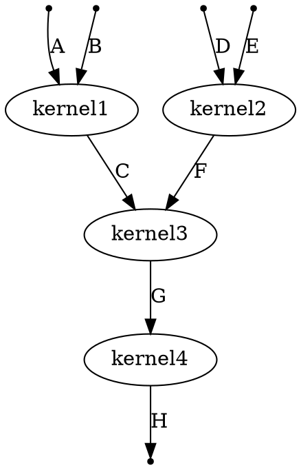

# Explicit Dependency Management in TFRT

<!--* freshness: {
  owner: 'jingdong'
  reviewed: '2021-04-07'
} *-->

<!-- TOC -->

In a host runtime MLIR program, dependencies between kernels follow the usual
dataflow dependency semantics: Kernel 1 depends on kernel 2 if kernel 1 uses the
output of kernel 2 as its input. Due to the presence of side-effecting kernels
and mutable types, we need a way to express explicit dependencies between
kernels in the host program MLIR code if the required dependency is not captured
by the data dependencies. For example, in the following code,
`initialize_tensor` needs to happen before the `print_tensor` kernel, but since
`print_tensor` does not take the result of `initialize_tensor` as its input,
there is no dependency between these two kernels and they may execute out of
order.

```c++
%t = allocate_tensor()
// initialize_tensor and print_tensor has no data dependency on each other and
// may get executed out of order.
initialize_tensor(%t)
print_tensor(%t)
```

In this document, we describe the approach that we take to inject explicit
control dependencies between these kinds of kernels in a host runtime program.

## `Chain`

To inject explicit control dependency between kernels, we introduce the concept
of `Chain`. `Chain` is an empty struct defined in
[chain.h](https://github.com/tensorflow/runtime/blob/master/include/tfrt/host_context/chain.h)
as follows:

```c++
class Chain {};
```

The sole purpose of `Chain` is to add dependencies between kernels that
otherwise would not have a dependency between them. For example, in the above
sample code, we can use `Chain`s to enforce the proper dependency as follows.

```c++
%t = allocate_tensor()
// Use chain to add proper dependency between initialize_tensor and print_tensor
%ch0 = tfrt.new.chain()  // create a chain
%ch1 = initialize_tensor(%t, %ch0)
%ch2 = print_tensor(%t, %ch1)
```

In the C++ kernel implementation, the `Chain` is added as both input and output
of a kernel as in the following example.

```c++
void FooKernel(Argument<int> arg, Argument<Chain> in_chain, Result<Chain> out_chain) {
  // Do something with arg
  out_chain.Set(in_chain);
}
```

The manual construction of `Chain` with `tfrt.new.chain()` should only be used
in test cases. In practice, we expect the compiler infrastructure to manage
`Chain`s so that they are passed into functions and kernels that need them, as
otherwise the executions may not be ordered properly.

## Explicit Dependency Management With `Chain`

In general, any kernels that have any of the following properties need to be
explicitly sequenced:

1.  The kernel has external observable side-effects, such as printing to the
    terminal and writing to a file,
1.  The kernel mutates any of its input arguments, e.g. by storing its output in
    one of its arguments,
1.  Any of the inputs of the kernel are of a mutable type.

For such kernels, we establish the convention that they take a `Chain` as one
its inputs and produce a `Chain` as one of its outputs. As a concrete example,
in TFRT, `Tensor` is modeled as a mutable type, thus, any kernels that operate
on `Tensor`s need to take a `Chain` as an input and produce a `Chain` as a
output. For example, the kernel signature for the `AddTensor` kernel is

```c++
void AddTensor(Argument<Tensor> tensor1,
               Argument<Tensor> tensor2,
               Argument<Tensor> result /*result argument*/,
               Argument<Chain> in_chain,
               Result<Chain> out_chain);
```

Take the following compute graph as another example, assuming all A, B, C, D, E,
F, G, and H are tensors,



The MLIR pseudo-code for the compute graph above will be as follows.

```c++
// Shape is an immutable type, so no chain is needed.
C = CreateTensor(shape)
c0 = CreateChain()

// C is a output argument. It takes chain c0 and returns chain c1.
c1 = kernel1(A, B, C, c0)

// Shape is an immutable type, so no chain is needed
F = CreateTensor(shape)
// F is a output argument. Note chain c0 is re-used here, so kernel1 and kernel2 can be parallelized.
c2 = kernel2(D, E, F, c0)

// The merge_chain kernel takes two chains as argument and produce one chain as its output
c3 = merge_chain(c1, c2)
// Shape is an immutable type, so no chain is needed.
G = CreateTensor(shape)
// F is an argument argument.
c4 = kernel3(C, F, G, c3)

// Shape is an immutable type, so no chain is needed.
H = CreateTensor(shape)
// H is a output argument. It takes chain c4 and returns chain c5.
c5 = kernel4(G, H, c4)
```

## Managing `Chain`s with Compiler

Manually managing the `Chain` argument and return value in MLIR can be tedious
and error-prone. Fortunately, managing dependencies between kernels is a natural
fit for compilers, which can inject the right use of `Chain`s in the code. To
assist the compiler on this task, we define a tablegen entry (e.g.
[basic_kernels.td](https://github.com/tensorflow/runtime/blob/master/include/tfrt/basic_kernels/opdefs/basic_kernels.td)
and
[dense_host_tensor.td](https://github.com/tensorflow/runtime/blob/master/include/tfrt/tensor/opdefs/dense_host_tensor.td))
in ODS for each kernel in TFRT which describes the kernel meta data, such as
whether the kernel is side-effecting and which of its input arguments may be
mutated.

## Discussion

Below we describe some concerns and discussions regarding the approach of using
`Chain`s for explicit dependency management.

*   Verbosity of kernel implementation

    Since many kernels need to take a `Chain` as an input and return a `Chain`
    as an output, this increases the verbosity for defining kernels. To address
    this issue, we expect a convenience kernel wrapper generated from MLIR ODS
    that will hide the boilerplate code for `Chain` management for common kernel
    definitions.

*   Verbosity in the MLIR code

    The prevalence of `Chain`s in the kernels makes the MLIR code more verbose
    and tedious to write. Since we expect MLIR code to be auto-generated by the
    compiler, this is not a real concern, although it does make hand-writing
    MLIR code for unit tests harder.

*   Runtime overhead due to unnecessary `Chain`

    Since the `Chain` is a required argument for all tensor kernels, we still
    need to pay the runtime cost of AsyncValue for the `Chain` even though the
    explicit dependency management is not needed in some cases.

*   One alternative approach we considered was to use argument values instead of
    the `Chain` argument for dependency management for certain side-effecting
    kernels.

    For example, to print out a value x, we can design the print kernel to be
    `print(x)`, instead of `print(x, chain)`, as long as we feed an up-to-date
    value x into `print()`.

    The concerns with this approach are:

    *   We think establishing the convention of “side-effecting kernels always
        taking a `Chain` as an input” might make it simpler to bootstrap the
        compiler codegen work, and removing the `Chain` argument selectively
        could become an optimization task that lands later.

    *   Kernels that do not take argument values still require an explicit
        `Chain` arg.

    *   If we rely on using argument values (instead of `Chain`) for dependency
        management, there is a risk in compiler algebraic optimization
        accidentally removing necessary dependencies. Below is a concrete
        example where this may lead to a problem.

        ```c++
        // Mutates "A" in place and also returns "A" as "C"
        C = in_place_add_tensor(A, B)
        D = mul(C, 0)
        E = add(D, A)  // Expects to see the mutated value of "A"
        ```

        Given that in the expected semantics, E needs to stay dependent on C, we
        cannot just break the dependency edge from C to D by constant folding D
        to 0 and produce the following code:

        ```c++
        // Mutates A and in place and also returns "A"
        C = in_place_add_tensor(A, B)
        E = A  // add(mul(C, 0), A) is optimized to just A
        ```

        In the above code, we have lost the dependency of second statement (`E =
        A`) on the first statement (`C = in_place_add_tensor(A, B)`).

*   Another alternative approach we considered for managing explicit dependency
    is to use the `identity_chain` kernel. The semantic of `identity_chain`
    kernel is that `identity_chain(A, chain)` always returns the value of A as
    its result. In addition, we require all side-effecting kernel to return a
    `Chain` as its result. Below is a concrete example of using this approach to
    specify explicit dependency between kernels.

    ```c++
    A = CreateTensor(shape);
    chain0 = FillTensor(A, 2);

    B = CreateTensor(shape);
    chain1 = FillTensor(B, 3);

    C = CreateTensor(shape);

    // Use identity_chain to ensure FillTensor finishes before AddTensor.
    A1 = identity_chain(A, chain0)
    B1 = identity_chain(B, chain1)
    chain2 = AddTensor(A1, B1, C)
    ```

    The concern with this approach is that executing `identity_chain()` as a
    kernel may incur a large overhead and it may be hard for the compiler to
    inject correct `identity_chain` kernels to enforce desired execution order.
