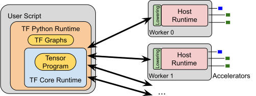
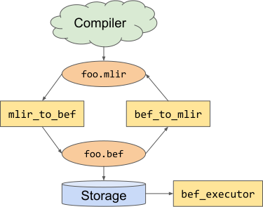

# TFRT Host Runtime Design

<!--* freshness: {
  owner: 'hongm'
  owner: 'jingdong'
  owner: 'lauj'
  owner: 'zhangqiaorjc'
  reviewed: '2020-03-27'
} *-->

<!-- TOC -->

## Objective

The new TensorFlow runtime (TFRT) project aims at delivering significant
improvements in accelerator support, performance, production deployment,
convergence between mobile and data center stacks, as well as architecture
modularity for improved engineering velocity.

This document focuses on the Host Runtime, the foundation of the new TensorFlow
runtime. Here is the overall TFRT architecture, and how the Host Runtime fits
in:



In this document, “host” refers to one computer that executes machine learning
computations. A host may or may not have accelerator hardware, and the
accelerator hardware might be heterogeneous. For example, a host could be a
server with several GPUs, or a mobile phone with a DSP and IPU, or an embedded
device without accelerators.

The Host Runtime is a low level dataflow graph executor. It orchestrates
computation on the host, and drives accelerators through Device Runtimes (GPU,
TPU, etc):


This document only covers the Host Runtime. Other important topics such as
lowering TF graphs, Device Runtimes, Core Runtime (the layer that provides eager
API) and Python Runtime are out of scope for this document.

## Motivation

TensorFlow has realized a tremendous impact in the ML ecosystem. From the
runtime perspective, the current architecture originally conceived around
2014-2015 requires a number of non-trivial changes in order to fulfill the needs
of the current and future ML workloads:

-   Efficient eager op execution

    -   Current TF stack is optimized for graph execution, and incurs
        non-trivial overhead when dispatching a single op. While the overhead is
        spread between python and runtime layers, a high performance low level
        runtime is a necessary part of the ultimate solution, towards improving
        e2e eager performance.

-   Unified CPU threading model for graph level and kernel level parallelism

    -   The inter-vs-intra threadpool division in current stack has known
        limitations.

-   Asynchrony as a first-class citizen in runtime

    -   This includes the support for non-strict kernel and function execution:
        a non-strict kernel/function may execute before all its inputs are
        ready.

-   Compiler friendly cross-kernel optimization

    -   Existing TF kernels encapsulate shape computation and memory allocation
        within the kernel implementation, making some graph compiler
        optimizations challenging or infeasible, such as reusing buffers across
        kernels. In TFRT kernels, shape computation and memory allocation will
        be hoisted out of the opaque C++ kernel implementations.

-   Modular and “pluggable” support for new accelerator devices

    -   Supporting new accelerator hardware in TensorFlow should not involve
        hacking the entire codebase. Instead, there should be well documented
        extension points for hardware teams.

-   Unified infrastructure across mobile and server. E.g. train on server and
    serve on mobile with minimal model conversion, and use the same kernels
    between mobile and server stacks when possible.

## Design Overview

In this document, we focus on the Host Runtime, and will describe the low level
mechanisms respectively for invoking a kernel and a kernel graph. We will also
touch on eager execution briefly.

Before diving into these host runtime components, we first provide some brief
background on how a (single-host) Core Runtime client request is processed and
passed onto the Host Runtime. TFRT will also include a cross-host distributed
runtime, but that is outside the scope of this document.

### Background: Core Runtime, Graph Lowering and Eager Execution

This subsection provides some conceptual background for readers to review the
Host Runtime design. Separate design documents on Core Runtime (and its
associated eager execution) and graph lowering will be written to provide more
details.

Core Runtime provides eager style C/C++ APIs, for users to dispatch a single op
or a graph function.

We refer to the graph function as an **op graph**. An op graph represents high
level dataflow dependencies between computations. Examples of op graphs include
GraphDef and HLO. Op graphs typically capture more of the programmer’s intent
than lower level representations, so they are more appropriate for compiler
analyses and transformations. An op graph is usually, but not always, portable
(aka device neutral).

Compiler passes lower an op graph to a **kernel graph**. A kernel graph is a low
level representation of a dataflow computation. Unlike op graphs, kernel graphs
are designed primarily for efficient execution, so they are generally less
suitable for compiler analysis. A kernel graph can be represented in a low level
dialect of MLIR, or other forms. Kernel graphs are platform specific, and
typically encode the specific accelerators that will run the computation.

Host Runtime provides mechanisms for executing kernel graphs and eagerly
executing ops. While eager execution is beyond the scope of this document, we
sketch the main ideas in a subsection below, after introducing the Host Runtime
abstractions.

### Low level abstractions: AsyncValue, Kernel, Threadpool, Allocator

A TFRT **kernel** is implemented by a C++ function that takes and returns a list
of `AsyncValue` objects. This design plays a large role in achieving the
high-level goal of “asynchrony as a first-class citizen in runtime.”

Each `AsyncValue` is a future that wraps and type-erases an underlying value,
such as an `int32` or a `Tensor`. When a kernel function returns, some
computation might get deferred, in which case the returned `AsyncValue` objects
are placeholders. See the [`AsyncValue` subsection](#asyncvalue) below for more
context.

An example kernel implementation is shown below:

```c++
// Kernel that adds two integers.
// AsyncKernelFrame holds the kernel’s arguments and results.
static void TFRTAdd(AsyncKernelFrame* frame) {
  // Fetch the kernel’s 0th argument.
  AsyncValue* arg1 = frame->GetArgAt(0);
  // Fetch the kernel’s 1st argument.
  AsyncValue* arg2 = frame->GetArgAt(1);

  int v1 = arg1->get<int>();
  int v2 = arg2->get<int>();

  // Set the kernel’s 0th result.
  frame->EmplaceResultAt<int>(0, v1 + v2);
}
```

We use the same kernel mechanism to manage devices, such as memory allocation,
data transfer and launching computation on devices. For example, `GPUExecute`
can be a kernel that starts executing a GPU program asynchronously. There will
be separate design docs on device support across GPU and other devices.

Kernels may schedule tasks on a threadpool for multi-core asynchronous
execution. Different thread pool implementations can be plugged into the design.
See the [Threading Model subsection](#threading-model) below for more context.

Similarly, different memory allocators can be plugged in. See the
[Memory allocation subsection](#memory-allocation) below.

### Graph Execution


For graph execution, a **host program** encodes a dataflow computation at the
kernel level (aka a “kernel graph”). We can use MLIR to represent such programs.
Here is an example graph function, expressed in MLIR:

```c++
func @sample_function() -> i32 {
  %one = tfrt.constant.i32 1       // Make AsyncValue with value 1
  %two = tfrt.constant.i32 2       // Make AsyncValue with value 2
  %three = tfrt.add.i32 %one, %two // Make AsyncValue with value 3 (1+2)

  tfrt.print.i32 %three            // Print AsyncValue %three
  tfrt.return %three : i32         // Return AsyncValue %three
}
```

A computational graph at the op level (aka an “op graph”) is also expressible in
MLIR (e.g. via the MLIR TF dialect), but could still originate from a GraphDef.
Op graphs are usually, but not always, portable. Kernel graphs are specific to a
target platform.

There will be an MLIR compiler that lowers the op graph to a kernel graph, where
relevant compiler passes will transform the portable op graph to a
device-specific kernel graph. The compiler and the relevant lowering passes are
outside the scope of this document.

To efficiently execute a kernel graph, the runtime does not directly process the
program’s MLIR representation. Instead `mlir_to_bef` converts the host program
to an in-memory format called Binary Executable Format, or **BEF**. BEF is a
kernel graph representation, and is `mmap`-able and more cache-friendly for
execution compared to MLIR’s serialized format. BEF also decouples the TFRT
graph executor from MLIR dependencies. See [BEF](#binary-executable-format-bef)
below for more context.

`BEFExecutor` reads a BEF file and executes its kernel graph. It tracks the
computation’s state in registers, which point to argument and result
`AsyncValue`s for all kernels in the graph. Registers help transfer data between
kernels. `BEFExecutor` invokes a kernel by creating a `AsyncKernelFrame` with
pointers to the kernel’s arguments and results, and passing the
`AsyncKernelFrame` to the kernel.

### Eager Execution Sketch

Eager execution involves calling kernels and using low level abstractions such
as threadpool and allocator. But it needs not always involve graph/BEF
construction or `BEFExecutor`.

Our general goal is to minimize redundant logic between graph and eager
execution support, while ensuring that eager execution need not be slowed down
by compiler dependency and BEF generation.

As such, the TFRT eager design involves a general path and a fast path. In the
general path, an op is treated as a graph function. This is especially suitable
when handling “composite ops”, which expand into a collection of ops and the
dependencies between them. The general path uses the same graph lowering
execution workflow described earlier. In the fast path, we use hand-written C++
or precompiled graph snippets for selecting and invoking the associated kernels
of an op. A separate document will be written on the eager execution design.

## Detailed Design

### `AsyncValue`

`AsyncValue` is the core data abstraction in TFRT and is the key building block
that enables fully asynchronous executions. Conceptually, an `AsyncValue` is
analogous to a combination of the
[future](https://en.cppreference.com/w/cpp/thread/future) and
[promise](https://en.cppreference.com/w/cpp/thread/promise) concepts in the
standard C++ library. In TFRT, we model all data in the computation graph as
`AsyncValue` objects. As such, `AsyncValue` is the common currency type that is
passed across kernels in a graph execution. It will also be exposed via the
eager API at Core Runtime level to the clients (outside the scope of this
document).

#### `AsyncValue` Lifetime

`AsyncValue` lifetime is managed through reference counting. This allows
`AsyncValue` objects to be shared by multiple consumers easily. The typical life
of an `AsyncValue` object involves the following stages.

1.  A kernel creates an `AsyncValue` object as its result.

1.  Ownership of one reference to the `AsyncValue` object transfers from the
    kernel to the `BEFExecutor`.

1.  `BEFExecutor` passes the `AsyncValue` object to downstream kernels that use
    the `AsyncValue`. `BEFExecutor` increases the `AsyncValue`’s reference count
    by one for each downstream kernel.

1.  Downstream kernels may extend the lifetime of the `AsyncValue` by increasing
    its reference count.

1.  As each downstream kernel completes execution, `BEFExecutor` reduces the
    `AsyncValue`’s reference count by one.

1.  The `AsyncValue` object is destroyed once all of the references are dropped.

#### The `AsyncValue` Class Hierarchy

The following class diagram shows the different types of `AsyncValue` and their
relationships. We will describe each of the `AsyncValue` classes in turn below.


##### `AsyncValue` (Base Class)

The `AsyncValue` class is the base class of the `AsyncValue` class hierarchy. It
holds the common fields of an `AsyncValue`, such as the reference count,
availability state, and the waiter list, and the public read and write access
functions to the object. A subset of the interface is shown in the following
pseudo-code.

```c++
// A subset of interface functions in AsyncValue.
class AsyncValue {
 public:
  // Is the data available?
  bool IsAvailable() const;

  // Get the payload data as type T.
  // Assumes the data is already available, so get() never blocks.
  template <typename T> const T& get() const;

  // Store the payload data in-place.
  template <typename T, typename... Args>
  void emplace(Args&&... args);

  // Add a waiter callback that will run when the value becomes available.
  void AndThen(std::function<void()>&& waiter);
  // ...
};
```

##### `ConcreteAsyncValue<T>`

`ConcreteAsyncValue<T>` is an `AsyncValue` subclass that holds data used in the
computation. A kernel creates an instance of this class to hold its result data
whenever the type of the return data is known. For example, the `MatMul` kernel
would create a `ConcreteAsyncValue<Tensor>` as its result.
`ConcreteAsyncValue<T>` stores the payload data in-place in the object, without
any heap allocation, as shown in the following pseudo-code for
`ConcreteAsyncValue<T>`.

```c++
// ConcreteAsyncValue<T> stores the payload T in-place.
template<typename T>
Class ConcreteAsyncValue : public AsyncValue {
 public:
   //...
 private:
  T value_;
};
```

##### `ErrorAsyncValue`

TFRT supports fine-grained error propagation: when a kernel encounters an error,
only the affected downstream kernels are skipped. TFRT also supports
cancellations, where the user can cancel pending execution at any time and
kernels that have not been scheduled are skipped. Both the error propagation and
execution cancellation are supported by `ErrorAsyncValue`.

For error propagation, `BEFExecutor` checks the result of each kernel to see if
it is an `ErrorAsyncValue` during execution. If an `ErrorAsyncValue` is
detected, `BEFExecutor` skips all the downstream kernels of the `AsyncValue` and
recursively propagates the `ErrorAsyncValue` as the results of those downstream
kernels in the graph. This allows only the downstream kernels of the
`ErrorAsyncValue` to be skipped.

To support execution cancellation, HostContext holds a cancel `AsyncValue`.
`BEFExecutor` periodically checks this `AsyncValue`, and skips all undispatched
kernel computations when this `AsyncValue` is set to an `ErrorAsyncValue`.
Therefore, to cancel a pending execution, the user simply needs to set this
`AsyncValue` to an `ErrorAsyncValue` object.

`ErrorAsyncValue` contains relevant diagnostic information, such as the error
message, source file name and line number, as shown in the following pseudo-code
`ErrorAsyncValue`.

```c++
class ErrorAsyncValue : public AsyncValue {
 private:
  // Error information including error message, file name, line number, etc.
  DecodedDiagnostic diag_info_;
};
```

When a kernel detects a runtime error, such as incorrect tensor shapes, it
returns `ErrorAsyncValue` with appropriate diagnostic information as its result.
An example usage of `ErrorAsyncValue` is shown in the following pseudo-code.

```c++
void MatMul(Argument<Tensor> a,
            Argument<Tensor> b,
            Argument<Tensor> result,   // For storing the result.
            Argument<Chain> in_chain,  // Chains are for dependency management.
            Result<Chain> out_chain,
            KernelErrorHandler handler) {
  if (!MatMulShapeCheck(*a, *b)) {
      // ReportError() internally creates ErrorAsyncValue and assigns
      // it to out_chain as the result.
      handler.ReportError(“Shape mismatch”)
      return;
  }
  // Compute the matmul of a and b and store it in result.
}
```

Please see our [error handling documentation](error_handling.md) for more
details related to error handling and cancellation support with
`ErrorAsyncValue`.

##### `IndirectAsyncValue`

A core design principle of TFRT is that kernel executions are never allowed to
block, as this allows us to have a fine-grained control over the number of
compute threads and the thread switching behavior, which is important for
achieving high CPU utilization. The non-blocking requirements sometimes lead to
situations where we need to create `AsyncValue` instances even when the data
type is unknown. Examples of such cases are:

-   During the execution of a BEF function, the kernel that computes the return
    value is deferred (because it has unavailable arguments), which causes the
    return data type to be unknown.
-   When `BEFExecutor` executes a non-strict kernel and not all the arguments
    for the non-strict kernel are available.

In all the above cases, the actual type of the `AsyncValue` is unknown at the
time of creation. In such cases, we create an `IndirectAsyncValue` as a
placeholder. Unlike `ConcreteAsyncValue<T>` and `ErrorAsyncValue`, which store
the data in-place in the object, `IndirectAsyncValue` holds a pointer to another
`AsyncValue` which is to be populated when the data is known. The pseudo-code
for the `IndirectAsyncValue` is shown as follows.

```c++
class IndirectAsyncValue : public AsyncValue {
 private:
  // IndirectAsyncValue contains a pointer to another AsyncValue.
  AsyncValue* value_;
};
```

See the [AsyncValue documentation](async_value.md) for detailed descriptions of
each of the above cases.

##### Performance Considerations

Since `AsyncValue` is the currency type for all data in a TFRT execution. We
strive to make the data structure as efficient as possible. As such, the current
implementation of `AsyncValue` uses the following techniques to minimize the
overhead of asynchronous executions.

-   Lock-free implementation: Instead of using mutexes, we implement
    `AsyncValue` with explicit atomic variables for synchronizing concurrent
    data access.

-   Avoid virtual functions and `dynamic_cast`: Instead of using the virtual
    functions and `dynamic_cast` feature of the C++ language, we manually manage
    dynamic dispatching via function pointers, use enum to encode the subclass
    for dynamic down casting, and implement an explicit type id mechanism for
    dynamic payload type checking. This allows us to compile TFRT without RTTI
    (`-fno-rtti`) and keep the object size and code size small by removing the
    need for virtual table and virtual table pointer.

-   Bit-packing for compactness: The bits in `AsyncValue` are arranged
    carefully, including using techniques such as `llvm::PointerIntPair`, to
    make it as compact as possible.

#### Kernels and Host Program

Kernels and host programs are another core abstraction in the host runtime.
Kernels are analogous to kernels in the current TensorFlow in that they are unit
of computations that the runtime dispatches, but otherwise TFRT kernels
implement a very different interface. Conceptually, a kernel takes a list of
`AsyncValue`s and attributes (compile-time constants) as arguments and produces
`AsyncValue`s as results.

A host program describes a DAG of kernels to be executed, analogous to a
GraphDef. Here is an example host program, expressed in MLIR.

```c++
func @sample_function(%ch0 : !tfrt.chain) -> (i32, !tfrt.chain) {
    // %one is an AsyncValue with constant 1.
    %one = tfrt.constant.i32 1
    // %two is an AsyncValue with constant 2.
    %two = tfrt.constant.i32 2
    // %three is an AsyncValue with constant 3.
    %three = tfrt.add.i32 %one, %two
    // Print %three and produce chain %ch1.
    %ch1 = tfrt.print.i32 %three, %ch0
    // Returns %three and %ch1.
    tfrt.return %three, %ch1 : i32, !tfrt.chain
}
```

The host program is verbose in syntax and very low-level. It is designed to be
generated by a compiler, rather than hand-written by humans. It allows for fast
dispatch by the runtime, and at the same time, is friendly to compiler
optimization.

When kernels are invoked in *strict* mode, all argument `AsyncValue`s will be
available before the kernel executes. If they are invoked in *non-strict* mode,
one or more arguments are available. Kernels attach continuation functions to
not-yet-available `AsyncValue`s using `AsyncValue::AndThen` or explicitly
dispatch tasks to a ConcurrentWorkQueue to be done asynchronously.

##### Type System

Kernel implementations are strongly-typed, even though `AsyncValue`s are
type-erased. With C++ template convenience wrappers (`Argument, Result,
Attribute, ArrayAttribute` etc.), TFRT kernels directly use concrete, native C++
data types. Note that Argument and Result are wrappers to access `AsyncValue`s
while Attribute and ArrayAttribute are wrappers to access constant values.
Argument and Attribute are not substitutable. In the following example kernel to
add two `int32_ts`, the kernel knows that arguments and result are `int32_t`.

TFRT kernels do not dynamically type check, for better performance. The
`Argument<int32_t>` templates below will unconditionally `static_cast` the
kernel’s arguments to `int32_t`.

```c++
static int32_t TFRTAddI32(Argument<int32_t> arg0, Argument<int32_t> arg1) {
  return *arg0 + *arg1;
}
```

When we compose kernel graphs from individual kernels, we get type safety from
MLIR compiler. The C++ kernels are strung together as an MLIR program, which is
strongly-typed and has compile-time type-checking to ensure that kernel
arguments and results are of the expected type.

By combining MLIR’s type safety with strongly typed kernels, the overall system
gains partial type safety without sacrificing performance. Types must match in
MLIR programs, and types are consistent within each kernel’s implementation.
Nevertheless, the system can’t guarantee type safety across kernel invocations
without additional runtime type checks. The system only performs these runtime
type checks in debug mode.

##### Dependency Management

Kernels may have side effects (e.g., write to stdout). Kernels may also be
stateful — their results may depend on state beyond their arguments. Relying on
the partial ordering from data dependencies alone may not always execute the
kernels in the order that produces correct results. In the following example,
the `print_tensor` kernel is not guaranteed to execute after the `fill_tensor`
kernel.

```c++
func @control_dep0() {
  %a = dht.create_uninit_tensor.i32.2 [2: i32, 2: i32]
  dht.fill_tensor.i32 %a 41
  dht.print_tensor.i32 %a
}
```

TensorFlow uses
[`tf.control_dependencies`](https://www.tensorflow.org/api_docs/python/tf/control_dependencies)
to express additional constraints on the kernel ordering. TFRT expresses control
dependency with `Chain`s. A `Chain` is just an `AsyncValue` that kernels can
consume as an argument or produce as a result. A `Chain` orders its consumer
after its producer. The example above can be modified by passing chains around
to explicitly order `dht.print_tensor` after `dht.fill_tensor`, and thus
guaranteeing the exact ordering for correctness.

```c++
func @control_dep1() {
  %a = dht.create_uninit_tensor.i32.2 [2 : i32, 2 : i32]
  %chain1 = dht.fill_tensor.i32 %a, 41
  %chain2 = dht.print_tensor.i32 %a, %chain1
 }
```

Please see our [explicit dependency documentation](explicit_dependency.md) for
more details on `Chain`s.

##### Defining Kernels

Kernels are defined as C++ functions and registered dynamically to a kernel
registry at runtime. They can be strung together easily with a MLIR host program
where the MLIR kernels have names that match kernel names in the registry. This
leads to an easily hackable system that is friendly to experimentation.

All argument and result `AsyncValue`s are staged in a `AsyncKernelFrame`, which
is a thin wrapper around a list of argument and result `AsyncValue` objects. The
`AsyncKernelFrame` is prepared and passed to a kernel when the kernel gets
invoked. The kernel can read all argument `AsyncValue`s and attributes from the
`AsyncKernelFrame`, and also allocate and modify result `AsyncValue`s on the
`AsyncKernelFrame`.

To make it easy for kernels to work with `AsyncValue`s, we provide high level
syntax sugar with templates such as `Argument<T>, Result<T>, Attribute<T>` and
others. They are wrappers around `AsyncKernelFrame` to allow kernels to deal
with C++ native data types directly with less boilerplate.

Here are some example kernel definitions. `Argument<T>` points to the payload of
the argument `AsyncValue`.

```c++
// A kernel that synchronously returns one value may return the value
// normally (static int32_t TFRTAddI32(...)). This is equivalent to
//   static void TFRTAddI32(Argument<int32_t> arg0, Argument<int32_t> arg1,
//                         Result<int32_t> result)
static int32_t TFRTAddI32(Argument<int32_t> arg0, Argument<int32_t> arg1) {
  return *arg0 + *arg1;
}

static Chain TFRTPrintI32(Argument<int32_t> arg, Argument<Chain> chain) {
  printf("%d\n", *arg);
  return *chain;
}
```

Arguments can be reused as results. The underlying `AsyncValue` gets a +1
refcount:

```c++
static void TestAtomicGetI32(Argument<std::atomic<int32_t>> in,
                             Argument<Chain> chain_in, Result<int32_t> out,
                             Result<Chain> chain_out) {
  out.Emplace(in->load());
  chain_out.Set(chain_in);
}
```

Result can also be pre-allocated, and modified in-place. Errors can be indicated
with `KernelErrorHandler::ReportError` which sets any unavailable result async
values to be `ErrorAsyncValue`s, and short-circuits downstream kernels.

```c++
// Computes C = alpha * A @ B + beta * C in-place.
template <typename T>
static void MatMul2D(Argument<T> alpha,
                     ArgumentView<DHTIndexableView<T, 2>> A,
                     ArgumentView<DHTIndexableView<T, 2>> B,
                     Argument<T> beta,
                     ArgumentView<DHTIndexableView<T, 2>> C,
                     Argument<Chain> chain_in, Result<Chain> chain_out,
                     KernelErrorHandler handler) {
  const auto& shape_A = A->FixedShape();
  const auto& shape_B = B->FixedShape();
  const auto& shape_C = C->FixedShape();
  if (shape_A[1] != shape_B[0]) {
    handler.ReportError("MatMul argument tensors inner dimension mismatch: ",
                        shape_A, " vs. ", shape_B);
    return;
  }
  if (shape_C[0] != shape_A[0] || shape_C[1] != shape_B[1]) {
    handler.ReportError("MatMul result shape ", shape_C,
                        " does not match product shape of arguments: ",
                        shape_A, " * ", shape_B);
    return;
  }

  if (!MatMul2DHelper<T>(alpha.get(), A.get(), B.get(),
                         beta.get(), C.get(),
                         shape_C[0], shape_C[1], shape_A[1])) {
    handler.ReportError("Error in MatMul2DKernel\n");
    return;
  }

  chain_out.Set(chain_in);
}
```

Variadic arguments and results are accessible as `RemainingArguments` and
`RemainingResults` respectively. For kernels that need to access shared host
resources, such as the concurrent work queue, host allocator, or shared context,
they can also take a `HostContext` as an argument.

```c++
static void TFRTIf(RemainingArguments args, RemainingResults results,
                  Attribute<Function> true_fn_const,
                  Attribute<Function> false_fn_const, HostContext* host) {
  const Function* true_fn = &(*true_fn_const);
  const Function* false_fn = &(*false_fn_const);
  // more code omitted...
}
```

Kernels are registered dynamically to `KernelRegistry` at runtime. The host
program in MLIR will invoke ops with the same names registered in
`KernelRegistry` with the appropriate argument and result async values and
attributes.

```c++
void RegisterIntegerKernels(KernelRegistry* registry) {
  registry->AddKernel("tfrt.constant.i1", TFRT_KERNEL(TFRTConstantI1));
  registry->AddKernel("tfrt.constant.i32", TFRT_KERNEL(TFRTConstantI32));
  registry->AddKernel("tfrt.add.i32", TFRT_KERNEL(TFRTAddI32));
  registry->AddKernel("tfrt.lessequal.i32", TFRT_KERNEL(TFRTLessEqualI32));
}
```

The `TFRT_KERNEL` template constructs `Argument, Result, KernelErrorHandler,
RemainingArguments, RemainingResults` and various other helper objects on the
stack when the kernel gets invoked.

Dynamically registering kernels in C++ and invoking them in MLIR as generic ops
are good for fast experimentation. For the subsets of kernels that we want to
standardize and make available to end-users, we should use the
[MLIR Operation Definition Specification (ODS)](https://mlir.llvm.org/docs/OpDefinitions/)
infrastructure to declare them and standardize on their signatures. MLIR ODS
allows us to have a single source of truth for facts about an MLIR op (or
equivalently a TFRT kernel). It uses the
[LLVM TableGen](https://llvm.org/docs/TableGen/) underneath, and is thus concise
and reduces boilerplate code. It is great for auto-generating C++ classes and
helper methods (accessors, verifiers etc.). Here is a simple op entry for
`AddI32Op` or equivalently the `TFRTAddI32` kernel.

```c++
def AddI32Op : TFRT_Op<"add.i32"> {
 let summary = "add.i32 operation";
 let description = [{
    The "tfrt.add.i32" operation takes two I32 arguments and returns their
    sum as the result. Example usage:

      %2 = tfrt.add.i32 %0, %1
 }];
 let arguments = (ins I32, I32);
 let results = (outs I32);
}
```

MLIR ODS and
[Declarative Rewrite Rules (DRR)](https://mlir.llvm.org/docs/DeclarativeRewrites/)
are also required for MLIR lowering passes from higher level dialect to runtime
dialect (e.g. mapping an op to a kernel graph).

#### Runtime Environment

##### Threading Model

We want to provide a unified CPU threading model for graph-level and
kernel-level parallelism. Our solution is to use the same set of threads to
dispatch kernels and run computations in them.

TFRT kernels must not block. The thread that runs a kernel may be the same
thread that dispatches other ready kernels. Kernels may have long running
computations (e.g. compute `MatMul` or `Conv2D`). Rather than making kernels run
all things synchronously and block kernel dispatch, we make kernels dispatch
background tasks to a `ConcurrentWorkQueue` to run asynchronously.

Kernels may need to block for IO. For backwards compatibility, we also need a
way to run the existing TensorFlow kernels which are often blocking. As a
result, we need threads that can run blocking work. We allocate two separate
pool of threads — non-blocking long running tasks are enqueued onto a
non-blocking work queue with a dedicated pool of threads, while blocking tasks
(such as IO) are dispatched to a separate pool of threads that are expected to
block.

The non-blocking work queue is expected to be fixed-size in thread count, with
one thread per hardware thread in steady state. This allows for minimal thread
contention. On the other hand, we may allocate a large number of threads in the
blocking work queue to handle blocking tasks such as disk IO in Linux. To avoid
deadlocks, TFRT kernels must only run blocking work in the blocking threadpool.
Kernel implementations must not directly block, and kernel implementations must
not offload blocking work to the non-blocking threadpool.

Since different use case calls for different `ConcurrentWorkQueue`
implementations, we cannot and will not prescribe "one true threading"
implementation. Mobile environments may do fine with a single worker thread,
while inference may want good tail latency guarantees. Our solution is to
provide default implementations for the single threaded model and the standard
UNIX thread model with reasonably good performance, while making it easy for
end-users to plug in their own `ConcurrentWorkQueue` to optimize for their use
case. An abbreviated API for `ConcurrentWorkQueue` is as follows:

```c++
class ConcurrentWorkQueue {
 public:
  // Enqueue a block of work.
  //
  // If the work queue implementation has a fixed-size internal queue of pending
  // work items, and it is full, it can choose to execute `work` in the caller
  // thread.
  virtual void AddTask(TaskFunction work) = 0;
  // Enqueue a blocking task.
  //
  // If `allow_queuing` is false, implementation must guarantee that work will
  // start executing within a finite amount of time, even if all other blocking
  // work currently executing will block infinitely.
  //
  // Return empty optional if the work is enqueued successfully, otherwise,
  // returns the argument wrapped in an optional.
  LLVM_NODISCARD virtual Optional<TaskFunction> AddBlockingTask(
      TaskFunction work, bool allow_queuing) = 0;
  // Block until the specified values are available (either with a value
  // or an error result).
  // This should not be called by a thread managed by the work queue.
  virtual void Await(ArrayRef<RCReference<AsyncValue>> values) = 0;
  // Block until the system is quiescent (no pending work and no inflight
  // work).
  // This should not be called by a thread managed by the work queue.
  virtual void Quiesce() = 0;
  // Returns the current size of the non-blocking threadpool. Kernels may
  // use this as a hint when splitting workloads.
  virtual int GetParallelismLevel() const = 0;
};
```

##### Memory Allocation

Heap allocations in the runtime are required to go through a single
`HostAllocator` instance. `HostAllocator` has a very simple API, that can be
easily subclassed to optimize for different use cases. For example, Google
production servers may want [`tcmalloc`](https://github.com/google/tcmalloc),
while embedded environments may want a more minimal allocator.

```c++
class HostAllocator {
 public:
  // Allocate memory for one or more entries of type T.
  template <typename T>
  T* Allocate(size_t num_elements = 1) {
    return static_cast<T*>(
              AllocateBytes(sizeof(T) * num_elements, alignof(T)));
  }
  // Deallocate the memory for one or more entries of type T.
  template <typename T>
  void Deallocate(T* ptr, size_t num_elements = 1) {
    DeallocateBytes(ptr, sizeof(T) * num_elements);
  }
}
```

#### BEF and `BEFExecutor`

##### Binary Executable Format (BEF)

BEF is TFRT’s low level serialized graph representation. It encodes a dataflow
graph that has been lowered to a specific hardware platform. Unlike the higher
level op graph, BEF encodes details like which devices to use for each kernel
(CPU/GPU/TPU) and specific kernels to invoke (`GPUDenseMatMul`).

BEF is the interface between the compiler and the runtime. BEF decouples the
compiler from the runtime, so compiler optimizations can be run offline,
producing a BEF file, and this BEF file can be written to disk and loaded much
later by the runtime for online use.

BEF is designed for efficient execution, not to support compiler
transformations. BEF files are arranged so the executor can load the file by
just mmap-ing it, and the serialized bytes are laid out for the executor’s
convenience. The executor evaluates the dataflow graph by directly reading the
mmap’d bytes.

BEF is composed of sections, and each section defines its own data format. BEF
is versioned, and new BEF versions can define new section types. The BEF reader
ignores unrecognized sections.

Please see our [BEF documentation](binary_executable_format.md) for details on
the file format.

##### Lowering to BEF

`mlir_to_bef` walks a MLIR module and emits a BEF binary. The MLIR module may be
written in any MLIR dialect with some limitations (one block per region, for
example). Higher levels of the compiler stack are responsible for lowering to
this MLIR module, and are out of scope for this document.

`mlir_to_bef` is the last lowering step of the compiler stack. This lowering is
very mechanical, and it functions like an assembler. There is a corresponding
tool `bef_to_mlir` that reverses this transformation, and functions like a
disassembler.



##### Execution Model

`BEFExecutor` evaluates low level kernel data flow graphs encoded in a BEF file.
It is an executor, not an interpreter, so a kernel may run whenever some or all
its arguments are available. There is no concept of a “program counter” as in an
interpreter. The executor is lock-free for good performance.

The executor is non-blocking: the executor never waits for a value to become
available. Instead, when a value is unavailable, the executor defers dependent
work with `AsyncValue::AndThen`. This approach is similar to continuation
passing.

###### Synchronous and Asynchronous Kernels

Synchronous kernels execute entirely on their calling thread, and do not offload
any work to other threads. Synchronous kernels produce available `AsyncValue`s.
Example:

```c++
int32_t TFRTAddI32(Argument<int32_t> arg0, Argument<int32_t> arg1) {
  // The thread that calls TFRTAddI32 performs this addition, and produces
  // an available AsyncValue.
  return *arg0 + *arg1;
}
```

Asynchronous kernels have two parts: a synchronous part that runs on the calling
thread, and an asynchronous part that runs on another thread. Asynchronous
kernels produce unavailable `AsyncValue`s. Example:

```c++
void TFRTAddI32Async(Argument<int32_t> arg0, Argument<int32_t> arg1,
                    Result<int32_t> output, HostContext* host) {
  // Synchronously allocate an unavailable AsyncValue for ‘output’.
  auto result = output.Allocate();

  // Asynchronously make ‘output’ available.
  host->EnqueueWork([arg0 = *arg0, arg1 = *arg1,
                     result_ref = FormRef(result)] {
    // A ConcurrentWorkQueue thread performs this addition.
    result_ref->emplace(arg0 + arg1);
  });

  // Synchronously returns unavailable ‘output’.
}
```

A kernel may be “partially asynchronous” by returning a mix of available and
unavailable values. Example:

```c++
void TFRTAddI32SyncAsync(Argument<int32_t> arg0, Argument<int32_t> arg1,
                        Result<int32_t> sync_result,
                        Result<int32_t> async_result,
                        HostContext* host) {
  sync_result.emplace(*arg0 + *arg1);

  auto result = async_result.Allocate();
  host->EnqueueWork([arg0 = *arg0, arg1 = *arg1,
                     result_ref = FormRef(result)] {
    result_ref->emplace(arg0 + arg1);
  });

  // Returns available sync_result and unavailable async_result.
}
```

###### Non-strict Execution

The executor supports *non-strict* execution, where a kernel may run as soon as
one of its arguments is available. Execution is *strict* by default, where a
kernel only runs when all of its arguments are available. Non-strict kernels can
be more efficient than strict kernels. For example, a
[ternary operator](https://en.wikipedia.org/wiki/%3F:) kernel like

```c++
result = ternary(condition, true_result, false_result)
```

can be written more efficiently as a non-strict kernel, because it only requires
its `condition`. `ternary` may safely execute before its other arguments
(`true_result, false_result`) are available, because `ternary` does not care
about the actual values of its other arguments, or even the availability of its
other arguments. `ternary` just forwards one of those arguments to its result. A
non-strict `ternary` kernel may return an unavailable value, like any other
asynchronous kernel. If `ternary` were written as a strict kernel, the kernel
would not run until all its inputs are available.

Non-strict kernels are also more difficult to write than strict kernels. Each
argument to a strict kernel can only be in one state (available), but each
argument to a non-strict kernel may be in one of two states (available or
unavailable). Non-strict kernels must be written with these two possibilities in
mind.

See the [Non-Strict Control Flow subsection](#non-strict-control-flow) for more
details.

###### Registers

The executor is a register machine: Each kernel’s arguments are fetched from
registers, and each kernel’s results are written to registers. A register is
just a pointer to an `AsyncValue`, so the executor only manipulates pointers to
values; it does not copy or move the actual values. Multiple registers may point
to the same `AsyncValue`.

The executor uses registers for internal bookkeeping: consider an “upstream”
kernel that returns an available value, and a “downstream” kernel that can’t run
yet because it requires another unavailable value:

```c++
available_value = upstream()
downstream(available_value, unavailable_value)
```

After `upstream` executes, the executor stores `available_value` in a register.
The executor can’t immediately invoke `downstream` because `downstream` can’t
run until `unavailable_value` becomes available. When `unavailable_value`
becomes available, the executor loads `available_value` from a register, and
passes it to `downstream`.

Conceptually, each register exists in one of three states:

1.  **Empty**: The register does not point to an `AsyncValue`. This is the
    initial state for all registers. Each register is written exactly once, so
    there is exactly one kernel that produces each register’s value. A register
    remains empty until the defining kernel runs.

2.  **Unavailable**: The register points to an unavailable `AsyncValue`. This
    state is only used by asynchronous kernels; synchronous kernels go directly
    from Empty to Available. Asynchronous kernels produce Unavailable registers
    because they return control to the executor before their results are
    available. Kernels must not leave their results in the Empty state, because
    that prevents downstream kernels from deferring work with
    `AsyncValue::AndThen`: we can’t call AndThen on an nullptr.

3.  **Available**: The register points to an available `AsyncValue`. Every
    register eventually reaches this state, and an Available register never
    reverts to Unavailable or Empty.


##### Execution Examples

###### Synchronous Execution

Kernels may synchronously run non-blocking, time-bounded work. This is useful
for small computations that are not worth moving to a background thread, like
scalar computations and shape inference. Synchronous kernels return available
values to the executor.

This kernel synchronously adds two `int32_t`’s:

```c++
int32_t TFRTAddI32(Argument<int32_t> arg0, Argument<int32_t> arg1) {
  return *arg0 + *arg1;
}
```

And this kernel synchronously prints an `int32_t`:

```c++
Chain TFRTPrintI32(Argument<int32_t> arg) {
  printf("%d\n", *arg);
  return Chain();
}
```

And we can synchronously run these two kernels with this MLIR:

```c++
func @double_and_print() -> i32 {
  %x = tfrt.constant.i32 42

  // * The ‘+’ in TFRTAddI32 runs synchronously, on the thread that called
  //   Execute(@double_and_print)
  // * TFRTAddI32 returns an available ConcreteAsyncValue<int32_t>
  // * %y points at this available value
  %y = tfrt.add.i32 %x, %x

  // printf in TFRTPrintI32 also run synchronously on the same thread, after
  // TFRTAddI32 due to dataflow dependence on %y
  tfrt.print.i32 %y

  // Returns available ConcreteAsyncValue<int32_t> after TFRTPrintI32
  // completes.
  // Note: tfrt.return is a special form that does not run a kernel. Chain
  // is not needed to sequence the tfrt.print.i32 above, before the
  // tfrt.return below. See Note below.
  tfrt.return %y : i32
}
```

<a id="tfrt_return"></a>Note: `tfrt.return` is a *special form* that specifies
the function’s return values. There is no kernel that implements `tfrt.return`,
unlike `tfrt.add.i32` (implemented by `TFRTAddI32`) and `tfrt.print.i32`
(implemented by `TFRTPrintI32`), so `tfrt.return` does not run like other
kernels. `tfrt.return` behaves like a non-strict kernel: `tfrt.return` does not
require any of its arguments to be available. `tfrt.return` occurs only after
the executor has attempted to run every kernel in the function. So in the
example above, the executor will first run `tfrt.print.i32`, and then
`tfrt.return` returns control to `@double_and_print`'s caller. `tfrt.print.i32`
and `tfrt.return` can not occur in parallel.

###### Asynchronous Execution

Asynchronous kernels are similar to synchronous kernels, except that they
perform part of their computation on background threads, and return unavailable
values instead of available values.

Kernels may not block, so synchronous kernels may not do blocking work like file
IO. Blocking work can only be done by asynchronous kernels, which offload the
blocking work to the `ConcurrentWorkQueue`.

An example kernel that performs a high latency read:

```c++
void TFRTAsyncReadFromMars(Result<int32_t> output, HostContext* host) {
  // Allocate an unavailable result.
  auto result = output.Allocate();

  // Asynchronously make ‘result’ available.
  host->EnqueueBlockingWork(
      // Add an extra ref to ‘result’ to ensure it remains alive until we
      // set it. Without this extra ref, the executor could destroy our
      // result before we set its value.
      [result_ref = FormRef(result)] {
    // Runs on ConcurrentWorkQueue
    int32_t from_mars = BlockingRead(…);
    result_ref->emplace(host, from_mars);
  });

  // Returns unavailable ‘result’, before BlockingRead completes.
}
```

An example MLIR driver for this kernel:

```c++
func @print_from_mars() -> i32 {
  // * EnqueueBlockingWork in TFRTAsyncReadI32FromMars runs synchronously on
  //   the thread that calls Execute(print_from_mars)
  // * BlockingRead runs asynchronously on a WorkQueue thread
  // * TFRTAsyncReadFromMars returns an unavailable
  //   ConcreteAsyncValue<int32_t>
  // * %y points at this unavailable value
  %y = tfrt.async.read.from.mars

  // * TFRTPrintI32 will not run until %y becomes available
  // * TFRTPrintI32 runs synchronously on the WorkQueue thread that produced
  //   %y
  tfrt.print.i32 %y

  // Returns unavailable ConcreteAsyncValue<int32_t>, before %y becomes
  // available
  tfrt.return %y : i32
}

```

Asynchronous kernels are compatible with synchronous kernels: the example above
shows an asynchronous `tfrt.async.read.from.mars` passing a result to a
synchronous `tfrt.print.i32`.

###### Control Flow

Kernels may invoke `BEFExecutor`, which allows ordinary kernels to implement
control flow. Only `tfrt.return` has special handling in `BEFExecutor`. All
other control flow (`call, if, repeat`, etc) is implemented with ordinary
kernels.

Example kernel that calls a function:

```c++
void TFRTCall(AsyncKernelFrame* frame) {
  // Get function to execute.
  auto& fn = frame->GetConstantAt<Function>(0);

  // Run ‘fn’, passing through tfrt.call’s args and results. ‘fn’ executes
  // on a new instance of BEFExecutor.
  fn.Execute(frame->GetArguments(),
             frame->GetResults(),
             frame->GetHostContext());
}
```

Example conditional kernel:

```c++
void TFRTIf(AsyncKernelFrame* frame) {
  const auto* true_fn = &frame->GetConstantAt<Function>(0);
  const auto* false_fn = &frame->GetConstantAt<Function>(1);

  // First arg is the condition.
  ArrayRef<AsyncValue*> args = frame->GetArguments();
  AsyncValue* condition = args[0];

  // Execute true_fn or false_fn depending on ‘condition’.
  auto* fn = condition->get<bool>() ? true_fn : false_fn;
  fn->Execute(args.drop_front(),
              frame->GetResults(),
              frame->GetHostContext());
}
```

By allowing kernel to invoke the executor, we move control flow logic out of
`BEFExecutor`’s core and into kernels, significantly reducing `BEFExecutor`’s
complexity, and allowing for user-defined control flow.

###### Non-Strict Control Flow

`BEFExecutor` normally runs a kernel “strictly”, which means a kernel’s
execution is deferred until all its arguments are available. This makes it
easier to write a kernel, because a kernel’s arguments are all just concrete
values - the kernel author does not have to worry about unavailable arguments.

But strictness can be inefficient for kernels like `tfrt.call`, which do not
require available arguments. An example of this inefficiency:

```c++
// Return first arg, ignore second arg.
func @return_first_arg(%x: i32, %y: i32) -> i32 {
  tfrt.return %x : i32
}

func @slow_call() -> i32 {
  %x = tfrt.constant.i32 42
  %y = tfrt.async.read.from.mars
  // Executor defers tfrt.call until %y is available, but @return_first_arg
  // won’t use %y!
  %z = tfrt.call @return_first_arg(%x, %y) : (i32) -> (i32)

  // Returns before %y becomes available. %z is an unavailable
  // IndirectAsyncValue
  tfrt.return %z : i32
}
```

In this example, the executor must defer `tfrt.call` until `%y` becomes
available, even though `return_first_arg` does not actually use `%y`.

This can run more efficiently with non-strict execution:

```c++
func @fast_call() -> i32 {
  %x = tfrt.constant.i32 42
  %y = tfrt.async.read.from.mars
  // * The calling executor invokes this nonstrict tfrt.call when any
  //   argument is available. %x is available!
  // * If a kernel in @return_first_arg used %y, called executor would
  //   defer execution of that kernel until it becomes available.
  %z = tfrt.call @return_first_arg(%x, %y) {bef.nonstrict} : (i32) -> (i32)

  // Returns before %y becomes available. %z is a available
  // ConcreteAsyncValue<int32_t>. %y is off the critical path.
  tfrt.return %z : i32
}
```

In this example, `tfrt.call` is nonstrict, so the executor can run
`tfrt.call`immediately after `%x` is available. The executor does not need to
defer `tfrt.call` until `%y` becomes available.

We can safely run `tfrt.call` as a non-strict kernel because `tfrt.call`
recursively invokes `BEFExecutor`, and `BEFExecutor` supports unavailable
arguments - it must understand unavailable arguments to run asynchronous
kernels.

## Current Status

All the aforementioned framework components have been built. There is also
support for tensors and tensor operations, including `MatMul`, `Relu`, etc. The
system design has been validated with simple inference models such as MNIST and
ResNet.

### Preliminary Evaluations

#### Code Size

One important design goal of TFRT is to make the framework as lightweight as
possible so that it is deployable in constrained environments such as mobile
devices. To this end, we are careful about depending on third-party libraries
and avoid using certain C++ features, such as exceptions and RTTI, which may
cause code bloat.

#### Runtime Performance

Another key goal for the TFRT project is achieving high performance. We
evaluated the performance of TFRT against the current TensorFlow and conducted
detailed performance analysis. TFRT is around twice as fast as the current
TensorFlow in our experiments. An important area of our on-going work is to
improve the performance of TFRT without losing generality.
